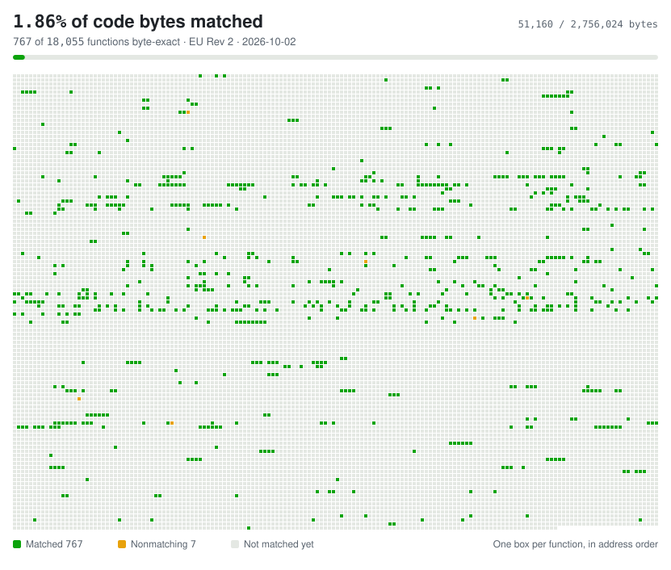

# Super Mario 3D Land decompilation

A private, model-driven matching decompilation of Super Mario 3D Land (EU), with a browser port to follow. See `project/BRIEF.md`.

This repository does not contain game data. Building it requires your own copy of the game.

## Credit

Built on [RE-Pepper](https://github.com/RE-Pepper/RE-Pepper) by its contributors, which forks [RedPepper](https://github.com/3dsdecomp/RedPepper) by the 3dsdecomp contributors. The build system, tools and map come from RE-Pepper. RE-Pepper's CtrSDK, NintendoWare and sead libraries were removed for provenance reasons.

Assembly diffing uses [asm-differ](https://github.com/simonlindholm/asm-differ). armcc runs through [wibo](https://github.com/decompals/wibo).

Upstream's readme states that the toolchain is MIT licensed and the decompiled code is CC0. Upstream's `License` file is the GNU General Public License v3 and is kept unchanged.
